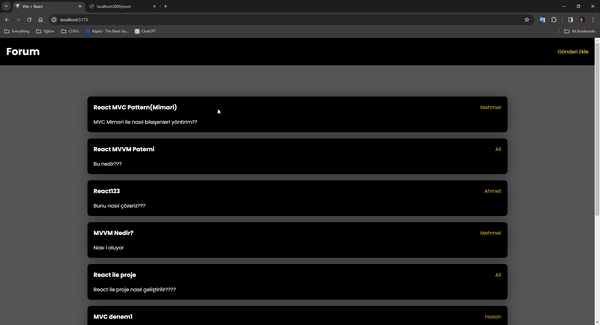

# Forum APP
I created a forum app with React. I developed this application based on MVC pattern.

I used json-server to manage my data. Thus, I completed my project by creating a list of articles when they were added and dynamics that could be edited afterwards. 

## Screen

# Libraries
- react-router-dom / axios / json-server / sass / uuid / react-toastify 
